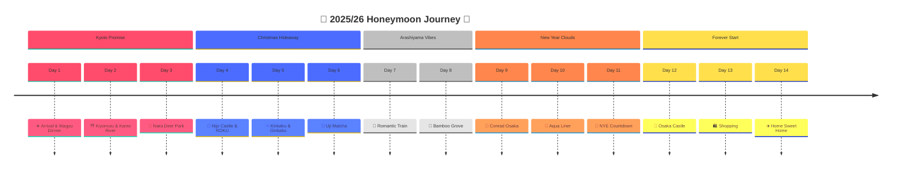

# 🇯🇵 【Worth the Wait】2025/26 京阪蜜月・領隊執行手冊

「從古都的深情承諾，到大阪雲端的嶄新開始。」

親愛的 Clarence 與 Erika：

歡迎開啟這趟期待已久的旅程。這份手冊不僅記錄了時間，更包含了每一餐的安排、安心旅遊歡迎來到我們的專屬旅行手冊！這裡記錄了我們接下來幾天的精彩行程。

---

## 🛡️ 保險與安心旅遊 (Insurance & Safety)

此次蜜月為冬季長天數旅行，建議投保「旅平險 + 不便險」以轉嫁風險。

**推薦投保方案比較**
建議於出發前 **5 天** 完成網路投保。

* **富邦產險 (Fubon)**：

  * **強項**：旅遊不便險（班機延誤／行李延誤）理賠門檻通常較明確，APP 操作便利。
  * **建議加強**：海外突發疾病醫療（含門診／急診）。日本醫療費用昂貴，建議醫療額度至少設定 **100 萬台幣以上**。

* **新安東京海上 (Tokio Marine Newa)**：

  * **強項**：日系背景，在日本當地的海外急難救助資源整合通常口碑不錯。
  * **重點**：針對「第三人責任險」（例如不小心打破店家的昂貴商品）保障通常不錯。

**投保重點檢查表**

* ✅ **海外突發疾病**：確認有包含「法定傳染病」（Covid-19／流感）且不限住院（包含門診）。
* ✅ **班機延誤**：冬天關西機場偶有大雪或強風導致延誤，確認理賠啟動時數（通常為 4 小時）。
* ✅ **英文投保證明**：投保後申請一份電子檔存在手機，日本就醫時備用。

---

## 💰 現金預算與支付攻略 (Cash & Budget Advice)

雖然日本刷卡已普及，但針對本次行程（嵐山居酒屋、新年神社參拜），現金仍不可或缺。

**建議攜帶現金總額**

* 兩人共約 **¥60,000 ~ ¥80,000** 日圓（約新台幣 **1.3 萬 ~ 1.7 萬**）。

**現金用途拆解 (Cash Breakdown)**

* **嵐山居酒屋 (Day 8)**：唯一明確 Cash Only 的正餐。預留 **¥15,000**。
* **新年參拜與御守**：神社／寺廟 99% 只收現金。預留 **¥20,000**（購買結緣御守、繪馬、香油錢）。
* **門票與參拜費**：金閣寺、銀閣寺、二條城等售票亭多收現金。預留 **¥10,000**。
* **屋台與販賣機**：新年路邊攤、暖手熱飲。預留 **¥10,000**。
* **緊急備用**：預留 **¥15,000**（計程車備案、臨時小額支出）。

**面額配置建議**

* **¥1,000 鈔票（最重要）**：請準備 20 ~ 30 張。搭車、買小吃找零最方便。
* **¥10,000 鈔票**：準備 4 ~ 5 張即可（主要用於居酒屋大額支付）。
* **零錢包**：必備！日本硬幣使用頻率極高。

---

## 🎒 行前準備檢查 (Pre-Departure Checklist)

1. **必備文件**

   * ✅ 護照：確認效期 **6 個月以上**。
   * ✅ Visit Japan Web (VJW)：出發前完成填寫並 **截圖 QR Code**。
   * ✅ 電子機票行程單。
   * ✅ 餐廳確認信：存於手機相簿（遇到網路不好時也能出示）。

2. **網卡與通訊**

   * ✅ 漫遊／eSIM：建議每人一組（高流量，因為需要一直查地圖／翻譯）。
   * ✅ Uber App：確認信用卡已綁定。
   * ✅ Google Translate：下載日文離線包（避免山區或室內沒訊號）。

3. **行李與衣物（12 月均溫：約 3°C ~ 11°C）**

   * ✅ 洋蔥式穿法：保暖大衣 + 發熱衣，方便室內外溫差調整。
   * ✅ 正式服裝 (Smart Casual)：為了 ROKU 與 Conrad 晚餐。
   * ✅ 保暖配件：圍巾、手套、毛帽（嵐山小火車必備）。
   * ✅ 藍牙喇叭：為了首晚的主題曲播放任務。

---

## ✈️ 航班與接送資訊 (Flight & Transfer)

| 項目   | 去程 (Outbound)                   | 回程 (Inbound)                    |
| ---- | ------------------------------- | ------------------------------- |
| 航空公司 | 星宇航空 (STARLUX) JX822            | 星宇航空 (STARLUX) JX823            |
| 日期   | 2025/12/21 (日)                  | 2026/01/03 (六)                  |
| 時間   | 09:20 TPE (一航) ➔ 12:50 KIX (一航) | 14:00 KIX (一航) ➔ 16:15 TPE (一航) |
| 日本接送 | 專車接機（出關後舉牌／聯繫）                  | 專車送機（11:00 DoubleTree 出發）       |

---

## 🗺️ 每日詳細行程與餐飲狀態 (Daily Itinerary & Meal Status)

> 下列為「典藏旅遊版」每日行程與餐飲安排，對應後文的「領隊執行手冊」

### 🏮 第一章：京都の約束 (The Promise of Kyoto)

#### Day 1｜12/21 (日)：序曲

* **12:50** 抵達關西機場。
* **13:40** 專車移動：前往京都（約 90 分鐘）。
* **15:30** Check-in：**Nazuna Kyoto Tsubaki St.**（含迎賓茶點）。

**本日餐飲安排**

* 🍳 **早餐：** ⭕️ 自理 — 出發前／機場。
* ☀️ **午餐：** ✈️ 機上 — 星宇航空飛機餐。
* 🌙 **晚餐：** ✅ 已預訂 — 大分和牛套餐 (Oita Wagyu Course) @ 飯店內（17:30）。
* 🎵 **20:00 蜜月儀式：** *Kyoto no Yakusoku* 房內首播（詳見領隊任務）。

#### Day 2｜12/22 (一)：經典與鴨川

* **08:00** 清水寺：Uber 直達，順遊二三年坂。
* **10:00** 星巴克二寧坂茶屋店：喝咖啡。
* **14:00** 鴨川散步：祇園四條 → 三條大橋。

**本日餐飲安排**

* 🍳 **早餐：** ✅ 飯店早餐 — Nazuna 精緻日式朝食。
* ☀️ **午餐：** ⭕️ 需安排 — 自由覓食。
  推薦：清水寺周邊湯豆腐料理（如：奧丹、順正）或蕎麥麵。
* 🌙 **晚餐：** ✅ 已預訂 — 牛肉壽司與涮涮鍋 @ 飯店內（17:30）。

#### Day 3｜12/23 (二)：奈良一日遊

* **09:30** 伏見稻荷大社（快閃千本鳥居）。
* **11:00** 奈良公園 & 東大寺（餵鹿）。
* **14:30** 中谷堂（搗麻糬表演）。

**本日餐飲安排**

* 🍳 **早餐：** ✅ 飯店早餐 — Nazuna。
* ☀️ **午餐：** ⭕️ 需安排 — 奈良美食。
  推薦：志津香釜飯（排隊名店，建議外帶去公園吃）或柿葉壽司（平宗）。
* 🌙 **晚餐：** ⭕️ 需安排 — 自由覓食。
  建議：請 Nazuna 櫃檯推薦附近的私房居酒屋或燒鳥店。

---

### 🎄 第二章：聖誕隱世 (Christmas Hideaway)

#### Day 4｜12/24 (三)：將軍的聖誕

* **09:45** 二條城（參觀二之丸御殿，需穿厚襪）。
* **12:30** 移動：回 Nazuna 取行李 → Uber 前往 ROKU。
* **15:00** Check-in：**ROKU KYOTO**（享受溫泉泳池）。

**本日餐飲安排**

* 🍳 **早餐：** ✅ 飯店早餐 — Nazuna。
* ☀️ **午餐：** ⭕️ 需安排 — 二條城周邊。
  推薦：簡單吃定食或烏龍麵。
* 🌙 **晚餐：** ✅ 已預訂 — 聖誕法式晚餐：TENJIN @ 飯店內（19:00）。

#### Day 5｜12/25 (四)：金與銀的聖誕

* **09:30** 金閣寺（晨光倒影）。
* **13:00** 銀閣寺 & 哲學之道（感受冬日侘寂之美）。

**本日餐飲安排**

* 🍳 **早餐：** ✅ 飯店早餐 — ROKU（Virtuoso 禮遇）。
* ☀️ **午餐：** ⭕️ 需安排 — 銀閣寺周邊。
  推薦：名代おめん (Omen) 烏龍麵沾麵（就在銀閣寺旁）。
* 🌙 **晚餐：** ⭕️ 需安排 — 自由覓食。
  建議：玩了一整天，可直接點 Room Service 或在飯店酒吧吃輕食，享受兩人世界。

#### Day 6｜12/26 (五)：八幡纜車與宇治茶香

* **10:30** 石清水八幡宮 & 參道纜車。
* **14:00** 茶與宇治的歷史公園 (Chazuna)。
* **15:00** 平等院 & 伊藤久右衛門（買伴手禮）。

**本日餐飲安排**

* 🍳 **早餐：** ✅ 飯店早餐 — ROKU。
* ☀️ **午餐：** ⭕️ 需安排 — 宇治美食。
  推薦：中村藤吉 本店（抵達宇治第一件事先去抽號碼牌）。
* 🌙 **晚餐：** ⭕️ 需安排 — 自由覓食。
  建議：回到 ROKU 飯店附近或市區簡單吃。

---

### 🎋 第三章：嵐山日常 (Arashiyama Vibes)

#### Day 7｜12/27 (六)：浪漫列車

* **13:30** 步行至車站（行李寄放 Homm Stay）。
* **14:02** 嵯峨野觀光小火車（富貴號 5 號車）。
* **20:00** 和服森林（嵐電光柱夜景）。

**本日餐飲安排**

* 🍳 **早餐：** ✅ 飯店早餐 — ROKU。
* ☀️ **午餐：** ⭕️ 需安排 — 嵐山街邊小吃。
  推薦：湯葉甜甜圈、中村屋可樂餅、% Arabica 咖啡。
* 🌙 **晚餐：** ✅ 已預訂 — 廣川鰻魚飯（18:00）。

#### Day 8｜12/28 (日)：竹林與煙火氣

* **07:30** 竹林小徑（無人時刻）。
* 上午：天龍寺庭園。

**本日餐飲安排**

* 🍳 **早餐：** ✅ 包含 — Homm Stay 房內日式輕食。
* ☀️ **午餐：** ⭕️ 需安排 — 嵐山午餐。
  推薦：嵐山よしむら (Yoshimura) 渡月橋畔蕎麥麵，或湯豆腐 嵯峨野。
* 🌙 **晚餐：** ✅ 已預訂 — ぼくらの食堂 (居酒屋)（18:00）。
  ⚠️ 提醒：**只收現金 (Cash Only)**。

---

## ☁️ 第四章：雲端跨年 (New Year in the Clouds)

#### Day 9｜12/29 (一)：轉場大阪

* **11:00** Check-out → Uber／MK Taxi 直達 Conrad Osaka。
* **15:00** Check-in：**Conrad Osaka**（享用 "Worth the Wait" 甜點）。

**本日餐飲安排**

* 🍳 **早餐：** ✅ 包含 — Homm Stay。
* ☀️ **午餐：** ⭕️ 需安排 — 移動途中。
  建議：在飯店附近簡單吃或到大阪後再吃。
* 🌙 **晚餐：** ⭕️ 需安排 — 大阪美食。
  推薦：北新地或福島區的燒肉／居酒屋。

#### Day 10｜12/30 (二)：水都風情

* **13:00** 新世界 & 通天閣（昭和復古街拍）。
* **15:00** Aqua Liner 水上巴士（淀屋橋港搭乘）。

**本日餐飲安排**

* 🍳 **早餐：** ✅ 飯店早餐 — Conrad（Hilton 禮遇）。
* ☀️ **午餐：** ⭕️ 需安排 — 新世界串炸。
  推薦：隨意挑一家熱鬧的串炸店（如：元祖串炸達摩）。
* 🌙 **晚餐：** ⭕️ 需安排 — 梅田商圈。
  建議：百貨公司餐廳街（LUCUA, Grand Front），選擇多且品質穩定。

#### Day 11｜12/31 (三)：跨年夜

* 白天：飯店放鬆／梅田逛街。
* **23:50**：Countdown 倒數。

**本日餐飲安排**

* 🍳 **早餐：** ✅ 飯店早餐 — Conrad。
* ☀️ **午餐：** ⭕️ 需安排 — 輕食。
  建議：為了晚上的大餐，中午吃簡單點（如：超商炸雞、飯糰）。
* 🌙 **晚餐：** ✅ 已預訂 — KURA 鐵板燒 FUKUJU 套餐 @ 飯店內（19:30）。

---

## 🏯 第五章：永遠的開始 (Start of Forever)

#### Day 12｜01/01 (四)：元旦

* **12:00** 移動：Uber 至大阪城。
* **14:00** Check-in：**DoubleTree Osaka Castle**。
* 下午：大阪天滿宮 初詣 & 大阪城公園散步。

**本日餐飲安排**

* 🍳 **早餐：** ✅ 飯店早餐 — Conrad。
* ☀️ **午餐：** ⭕️ 需安排 — 天滿宮屋台。
  體驗：日本新年的路邊攤（炒麵、章魚燒、糖葫蘆）。
* 🌙 **晚餐：** ✅ 已預訂 — SEN 新年自助餐 @ 飯店內（18:00）。
  驚喜：19:00 上 "Start of Forever" 蛋糕。

#### Day 13｜01/02 (五)：祈福與購物

* **09:30** 難

---

## 🎒 出發前最後確認 (Pre-Flight)

請確認以下物品已在隨身行李中：

* 兩人的護照。
* 所有飯店與餐廳的預約確認信（電子檔）。
* 日幣現金（建議 ¥80,000）。

<!-- SECRET_START -->

> ⚠️ **領隊注意 (Leader's Check)**
>
> * 藍牙喇叭：確認已充電，並放在隨手可拿的地方（Day 1 晚上要用）。
> * 音樂檔案：確認《Kyoto no Yakusoku》已下載至手機（勿只靠串流）。
> * 網卡：確認兩人的 eSIM 漫遊都已設定完成，落地即啟用。

<!-- SECRET_END -->

---

## 🏮 第一章：京都の約束

### Day 1｜12/21 (日)：序曲

* **12:50** 抵達關西機場 (KIX)。
* **13:40** 搭乘專車前往京都。
* **15:30** 入住 **Nazuna Kyoto Tsubaki St.**

**晚上：和牛晚餐與私人時光**

* **17:30** 飯店內享用 **大分和牛套餐**。

<!-- SECRET_START -->

> 🎵 **驚喜任務 (Surprise Mission) - 20:00**
>
> * 晚餐後回到房間，建議先去放半露天風呂的熱水。
> * 趁 Erika 卸妝或整理行李時，悄悄連上藍牙喇叭。
> * **Action**：當兩人都放鬆下來時，按下播放鍵，首播主題曲《Kyoto no Yakusoku》。
> * 台詞參考：「這是我為了這次蜜月，特別寫的一首歌。」

<!-- SECRET_END -->

---

### Day 2｜12/22 (一)：經典與鴨川

* **08:00** Uber 前往清水寺（避開人潮）。
* **14:00** 鴨川散步（祇園四條 → 三條大橋）。

<!-- SECRET_START -->

> 📸 **領隊筆記**
>
> * 鴨川是拍「蜜月合照」的最佳地點，記得帶腳架或請路人幫忙。
> * **17:30 晚餐**：已預約飯店內「牛肉壽司與涮涮鍋」。
>
>   * 領隊需確認櫃檯是否已安排菜單變更。

<!-- SECRET_END -->

---

### Day 3｜12/23 (二)：奈良一日遊

* **09:30** Uber 前往奈良（設定導航至奈良公園）。
* **10:30** 餵鹿、東大寺。

<!-- SECRET_START -->

> 💰 **現金提醒 (Cash Alert)**
>
> * 奈良的門票、鹿仙貝（¥200）、中谷堂麻糬（¥200/個）全部只收**現金**。
> * 午餐若吃「志津香」或「柿葉壽司」，也建議準備現金。
> * 晚餐：回到京都後自由覓食，記得先看好 Nazuna 推薦的居酒屋名單。

<!-- SECRET_END -->

---

## 🎄 第二章：聖誕隱世

### Day 4｜12/24 (三)：平安夜

* **09:45** 參觀二條城（需穿厚襪）。
* **15:00** 入住 **ROKU KYOTO**。

**晚上：聖誕法式晚餐**

* **19:00** 餐廳 **TENJIN**。

<!-- SECRET_START -->

> 🎄 **聖誕任務 (Xmas Mission)**
>
> * **Dress Code**：提醒兩人換上 Smart Casual 服裝（襯衫／洋裝）。
> * **菜單確認**：預約的是 **TENJIN Course (¥24,000)**，含金目鯛與和牛。
> * **泳池**：下午若要使用 Thermal Pool，記得把泳衣拿出來。

<!-- SECRET_END -->

---

### Day 5｜12/25 (四)：金與銀

* **09:30** 金閣寺（晨光倒影）。
* **13:00** 銀閣寺 & 哲學之道。

---

### Day 6｜12/26 (五)：宇治茶香

* **10:30** 石清水八幡宮纜車。
* **12:30** 宇治午餐（中村藤吉）。

<!-- SECRET_START -->

> 🍵 **領隊筆記**
>
> * 抵達宇治後，**第一件事**是去中村藤吉本店抽號碼牌，然後再去逛商店，節省時間。
> * **伴手禮**：伊藤久右衛門適合買抹茶粉與甜點送親友，可退稅。

<!-- SECRET_END -->

---

## 🎋 第三章：嵐山日常

### Day 7｜12/27 (六)：浪漫列車

* **14:02** 搭乘嵯峨野小火車（富貴號 5 號車 1A, 1B）。
* **16:00** 入住 **Homm Stay Nagi Arashiyama**。

<!-- SECRET_START -->

> 🧥 **保暖與票券 (Warmth & Ticket)**
>
> * 車票：QR Code 已存在手機相簿，隨時準備出示。
> * 保暖：富貴號是開放式車廂，上車前務必提醒 Erika 戴上圍巾和帽子。
> * 晚餐：**18:00 廣川鰻魚飯**（已付訂金），請準時出席，逾時不候。

<!-- SECRET_END -->

---

### Day 8｜12/28 (日)：竹林與煙火氣

* **07:30** 竹林小徑（無人時刻）。
* **18:00** 晚餐：**ぼくらの食堂**。

<!-- SECRET_START -->

> ⚠️ **高度重要 (Critical)**
>
> * 這家餐廳 **CASH ONLY（只收現金）**。
> * 請確認錢包內至少有 **¥15,000 現金**。
> * 沒有英文菜單，準備好 Google Translate App（拍照翻譯功能）。

<!-- SECRET_END -->

---

## ☁️ 第四章：雲端跨年

### Day 9｜12/29 (一)：轉場大阪

* **11:00** 移動至大阪。
* **15:00** 入住 **Conrad Osaka**。

<!-- SECRET_START -->

> 🍰 **驚喜檢查 (Check-in)**
>
> * 進房後，請不動聲色地確認桌上是否有 **"Worth the Wait ♡"** 的甜點盤。
> * 如果沒有看到，請藉故打電話給櫃檯確認（不要讓 Erika 聽到）。

<!-- SECRET_END -->

---

### Day 11｜12/31 (三)：跨年夜

* **19:30** 晚餐：**KURA 鐵板燒**。
* **23:50** 倒數迎接 **2026**。

<!-- SECRET_START -->

> 🥂 **跨年任務 (NYE Mission)**
>
> * 菜單：**FUKUJU (福壽) 頂級套餐 (¥52,000/人)**。
> * 這是 2025 最後一餐，好好享受，不需要趕時間。
> * 倒數時，建議在 40 樓大廳感受氣氛，或者回房間享受私密時光。

<!-- SECRET_END -->

---

## 🏯 第五章：永遠的開始

### Day 12｜01/01 (四)：元旦

* **14:00** 入住 **DoubleTree Osaka Castle (Castle View)**。
* **18:00** 晚餐：**SEN 新年自助餐**。

<!-- SECRET_START -->

> 🎂 **關鍵時刻 (The Moment) - 19:00**
>
> * 這是蜜月的最後一個驚喜。
> * 預設在 **19:00**（用餐一小時後），服務生會送上寫有 **"Start of Forever ♡"** 的紀念蛋糕盤。
> * **Action**：請服務生幫忙拍下與大阪城夜景的合照。這張照片將是這趟旅程的完美句點。

<!-- SECRET_END -->

---

### Day 13｜01/02 (五)：初売り

* 全日購物（心齋橋／梅田）。
* 晚上：**teamLab Botanical Garden**。

---

### Day 14｜01/03 (六)：尾聲

* **11:00** 專車送機。
* **14:00** 飛往台北。

---

祝 Clarence 與 Erika 的蜜月旅程圓滿順利！💍✨
